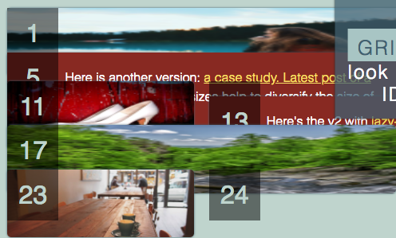
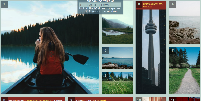

Grid layout으로 masnory layout 표현
===

[https://codepen.io/Kseso/pen/ZJbEMe](https://codepen.io/Kseso/pen/ZJbEMe)

Masonry layout을 그리드로 표현...

[https://masonry.desandro.com/](https://masonry.desandro.com/)

Masonry 라는 레이아웃 표현 형식이 있다.

jQuery plugin 형식으로 라이브러리도 있다.



처음 포팅 후 위와 같이 이미지크기가 제대로 반영이 안되는 문제가 있었다.

번호 표시를 위한 after pseudo element 만이 그 높이를 유지하고 있었다.

기본적으로 다음과 같은 grid를 사용한다.

```css
        grid-template-columns: repeat(auto-fill, minmax(calc(8rem + 5vw + 5vh), 1fr));
```

`auto-fill`과 `minmax`로 column 너비의 최대/최소 값을 지정할 수 있다.([관련 설명](https://rachelandrew.co.uk/archives/2016/04/12/flexible-sized-grids-with-auto-fill-and-minmax/), [스펙](https://drafts.csswg.org/css-grid/#auto-repeat))

최소 값 만큼 반복적으로 배열하고, 남으면 이를 1 fraction 설정에 따라 동일한 너비로 배열하게 된다.

원본 작품은 `` tag에 `width: 100%` 속성을 주었지만, 동작을 하지않았다. 다행히 `min-width: 100%`를 적용한 뒤에 원하는 모습을 볼 수 있었다. (#0115f73)



마지막으로 `dense` 설정을 통해 Masonry layout을 구현한다.

``` css
        grid-auto-flow: dense;
```

하지만, 보여지는 아이템의 순서를 보장받을 수 없기 때문에 적절한 선택이 필요할 것 같다.
